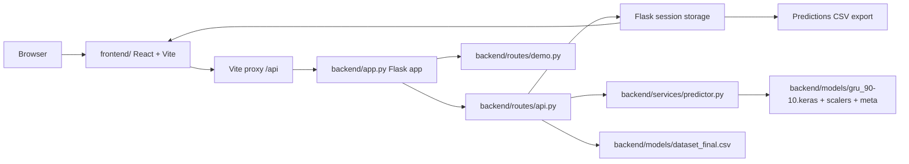

# Architecture

## System Overview

This is a single-user local research dashboard. The backend owns the model, session state, and API contract. The frontend owns presentation, charting, and polling for async prediction jobs.

## Backend Flow

- `backend/app.py` loads `backend/.env`, requires `SECRET_KEY`, configures CORS, enables filesystem sessions, and registers the blueprints.
- `backend/routes/api.py` serves the main application contract:
  - `GET /api/health`
  - `POST /api/upload`
  - `GET /api/sample-data`
  - `POST /api/predict`
  - `GET /api/job/<job_id>/status`
  - `GET /api/metrics`
  - `GET /api/export`
  - `GET /api/dashboard`
  - `GET /api/historical`
- `backend/routes/demo.py` serves `POST /api/demo` for parallel request benchmarking.
- Session data keeps the active dataset, predictions, metrics, and export state.

## Async Prediction Flow

1. The frontend submits `POST /api/predict` with `{days}`.
2. The backend validates the session dataset and creates a background job.
3. `PredictionContext.jsx` polls `GET /api/job/<job_id>/status` every 2 seconds.
4. When the job completes, the backend writes predictions, dates, metrics, and model mode back into the session.
5. The frontend updates charts and the export button from the completed result.

This async path is intentional. The old request/response path is not the active contract.

## Model Service

- `backend/services/predictor.py` wraps the GRU model in a singleton `GoldPredictor`.
- The service loads:
  - `backend/models/gru_90-10.keras`
  - `backend/models/scalers_90-10.joblib`
  - `backend/models/meta_90-10.joblib`
- It performs feature engineering, scaling, recursive multi-step prediction, and fallback forecasting if model inference fails.
- The predictor expects a 60-day lookback and a 19-feature engineered input set.

## Frontend Flow

- `frontend/src/App.tsx` sets up `ThemeProvider`, `PredictionProvider`, and the route tree.
- `frontend/src/components/Layout.jsx` renders the shell, navigation, theme toggle, and active prediction status.
- `frontend/src/context/PredictionContext.jsx` owns async prediction state, job id, polling, and result handoff.
- `frontend/src/services/api.js` is the only direct Axios entrypoint to the backend.
- Pages are:
  - `Dashboard.jsx` for summary charts and stats
  - `Predict.jsx` for upload, sample data, prediction, and export
  - `History.jsx` for period-based trend analysis

## Data And Storage

- The live app state lives in Flask session storage, not a database.
- Uploads are parsed and normalized server-side.
- `backend/models/dataset_final.csv` is the built-in sample dataset used by `/api/sample-data` and auto-load fallbacks.
- `demo_dataset.csv` at the repo root is the preserved dataset artifact the user asked to keep.
- `backend/models/dataset_final.csv` is an internal sample asset, not the user-facing working file.

## Operational Boundaries

- This repo is local and single-user.
- There is no authentication layer.
- The frontend relies on the backend session cookie and Vite proxy.
- The demo endpoint is for concurrency benchmarking, not product prediction.
